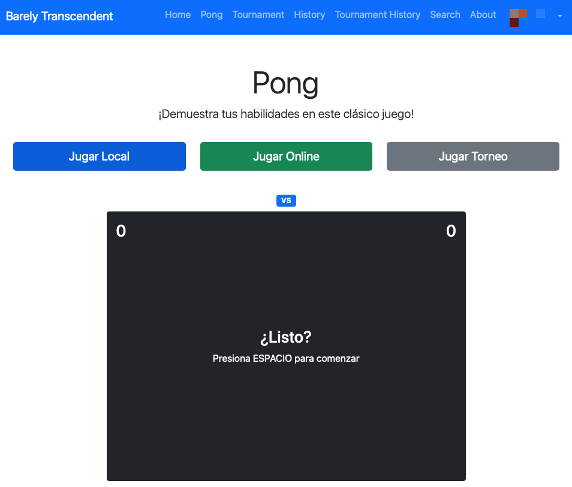
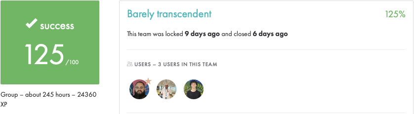

# Barely Transcendent – ft_transcendence @ 42 Madrid FT

**Real‑time Pong tournament platform · Django 5 · Channels 5 · Ethereum test‑chain**




> Repository frozen for **peer‑evaluation** at 42 Madrid Fundación Telefónica.  
> This README details the technologies integrated and our learning journey.


---

## 1 – Project Goals

* Deliver a single‑page web app where users play live Pong & Swiss‑style tournaments.
* Integrate ≥ 7 required subject modules.
* Containerise everything for a one‑shot `docker‑compose up --build`.
* Apply security best‑practices (HTTPS, hashed creds, XSS/SQLi‑safe, TLS).
* Document the stack to aid fellow cadets exploring new tech.

---

## 2 – Modules & Tech Matrix

| Subject Module | Type | Our Implementation |
|----------------|------|--------------------|
| Use a Framework as backend | **Major** | **Django 5** + **Channels 5** (ASGI) |
| Use a front‑end toolkit | Minor | **Bootstrap 5**, ESModules |
| Use a database for the backend | Minor | **PostgreSQL 17‑alpine** |
| Store score on the Blockchain | **Major** | **Ethereum** test‑chain (`truffle` + `ganache`) + **Solidity** |
| Standard user management | **Major** | Custom Django model, avatars, stats |
| Remote authentication | **Major** | **OAuth 2.0** with 42 API (`social‑auth`) |
| Remote players | **Major** | WebSockets via Channels (Daphne) |
| GDPR options | Minor | Data export / anonymise / delete |
| Monitoring system | Minor | **Prometheus v2.53** + **Grafana 11.6** |
| Backend as Microservices | **Major** | 7 Docker services |
| Browser compatibility (Safari) | Minor | Safari 17 E2E test suite |
| Browser compatibility (Firefox) | Minor | Firefox 124 E2E test suite |

Minor ×2 = 1 Major ⟹ **9 Major equivalents** achieved (> 7 required).



---

## 3 – Learning Highlights

* **Async Django** – embracing ASGI, broadcast groups and back‑pressure.
* **42 OAuth** – the full token dance & secure manage accounts.
* **Smart‑contracts** – Solidity event logging & Truffle migrations.
* **Docker** – multi‑stage, healthchecks, and network‑only volume shares.
* **Observability** – metrics vs. logs, Grafana auto provisioning.
* **GDPR** – anonymisation & proper deletion.
* **Browser quirks** – Safari WebSocket buffering, Firefox flex‑gap, fixed with polyfills.

---

## 4 – Container Stack (docker‑compose)

| Service | Image / Build | Role | Ports | Notes |
|---------|---------------|------|-------|-------|
| **django** | `python:3.13-slim` (custom `django.Dockerfile`) | Web app (Daphne) | 8000 | mounts built contracts & media volume |
| **db** | `postgres:17.4` | Relational DB | 5432 | init via env variables |
| **redis** | `redis:7.4.2` | Cache + channel layer | 6379 | password‑protected |
| **ganache** | build `blockchain/Dockerfile.ganache` | Ethereum test‑chain | 8545 | health‑checked JSON‑RPC |
| **truffle** | build `blockchain/Dockerfile.truffle` | Contract migration | – | waits for healthy ganache |
| **prometheus** | `prom/prometheus:v2.53.4` | Metrics scrape | 9090 (internal) | external‑url set via `${CAMPUS_HOST}` |
| **grafana** | `grafana/grafana:11.6.0` | Dashboards | 3000 (internal) | anonymous read‑only |
| **nginx** | `nginx:1.25` | TLS reverse‑proxy & static | **1443** | HTTP/2, serves Grafana & Prometheus sub‑paths |

**Networks**

```yaml
networks:
  barely_a_network: { driver: bridge }
```

**Volumes**

```yaml
postgres-data:   # pg data
grafana-data:    # dashboards & users
media-data:      # user‑uploaded avatars
```

Services depend on `ganache` and `redis` health to start; Daphne command auto‑runs migrations and `collectstatic`.

---

## 5 – Environment Variables (`.env.sample`)

| Key | Purpose |
|-----|---------|
| `OAUTH_42_CLIENT_ID` / `SECRET` | 42 Intra OAuth2 credentials |
| `CAMPUS_HOST` | Public base URL for reverse‑proxy (`https://post.42madrid.com`) |
| `POSTGRES_*` | DB init creds & port |
| `REDIS_PASSWORD`, `REDIS_PORT` | Secures Redis instance |
| `TRUFFLE_HOST/PORT/NETWORK_ID` | Truffle migration target |

> During defence **never commit real secrets** – only use the sample.

---

## 6 – Quick Start

```bash
git clone https://github.com/bazuara/Barely-Transcendent.git
cd Barely-Transcendent

cp .env.sample .env              # fill IDs, secrets, passwords
docker compose up --build
```

Open **https://localhost** – the site is served via HTTP/2 behind Nginx with a self‑signed cert.

---

## 7 – Repository Layout

```text
├── django.Dockerfile
├── docker-compose.yml
├── blockchain/         # Solidity, Truffle config
├── transcendence/      # Django project
│   ├── pong/           # game logic & consumers
│   └── users/          # auth, GDPR helpers
├── nginx/              # reverse-proxy rules
├── prometheus/         # scrape config
├── grafana/            # dashboards & provisioning
└── static/             # collected assets
```

---

## 8 – Blockchain Component

* Contract: `contracts/Tournament.sol`
* Local chain: `ganache-cli -i 5777`
* Migration: `docker compose run truffle migrate --network development`
* Read example: `blockchain/check_last_tournament.py`

---

## 9 – Monitoring & Observability

* **Prometheus** scrapes `/metrics` on `django`, `db`, `redis`, `ganache`.
* **Grafana** auto‑loads two JSON dashboards:
  * *Django overview* – latency, WS throughput, error rate
  * *Requests by view* – per‑endpoint breakdown
* Alerts fire on:
  * DB latency > 250 ms for 2 m
  * WS error ratio > 1 % for 1 m

---

## 10 – GDPR & Data Governance

* **Anonymization** User can choose to delete all his personal data from the app, ensuring no personal data remains. Data generated during usage remains, irreversiblely anonimized.

---

## 11 – Browser Compatibility

Validated on:

* **Chrome 124**
* **Safari 17**
* **Firefox 124**

> Edge hasn’t been graded but works as it users a chromium engine.

---

## 12 – Team Reflection

We are three 42 Madrid students who teamed up to build this project—and to learn by doing:

**guortun-** designed the overall architecture and delivered the backend, frontend, the Pong game itself and the database layer.

**bazuara** focused on DevOps and development platform: Docker containers, dev-containers, micro-service layout and the full monitoring stack.

**agserran** concentrated on bug-fixing, testing and performance tuning, sharpening the system’s stability and polish.

Crafting this application has deepened our skills in systems administration and collaborative development; every technical hurdle became a stepping-stone toward becoming stronger professionals.

© 2025 – MIT License.
